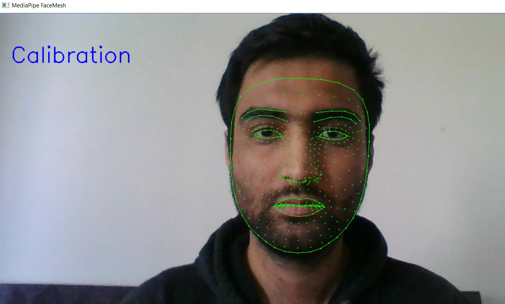

# Drowsiness-Detection-Mediapipe

The code uses [MediaPipe](https://google.github.io/mediapipe/) model for detecting a face in the video stream.

Features based on facial landmark positions are calculated and are used by a LSTM model to predict whether the use is alert or drowsy. 

As a first step, calibration is performed, which calculates the facial features over a small number of frames. The user is reminded to be in neutral position in this process. 

Calibration returns the mean and standard deviation values to normalize the facial features at inference step. 

###### Fig 1: Calibration

During inference, first the features are calculated and are normalized. These features are sent over to the LSTM model to make a prediction. The LSTM model computes its prediction over five continuous frames and returns the predicted state. 

###### Fig 2: Alert State 

###### Fig 3: Drowsy State 

###### Fig 4: Demo inference

## Projects

[Sleepless Academy](https://github.com/Samradh007/sleeplessAcademy)

We apply the idea of drowsiness detection to a virtual classroom / online MOOC platform setting. The WebApp shows a demo where the student is alerted when drowsy. The statistics obtained over the course can then help course content creators to improve their offerings. 

 

###### Fig 5: Web Application Demo 

## Authors

* [Samradh Agarwal](https://github.com/Samradh007)
* [Abhishek Tandon](https://github.com/Tandon-A)

